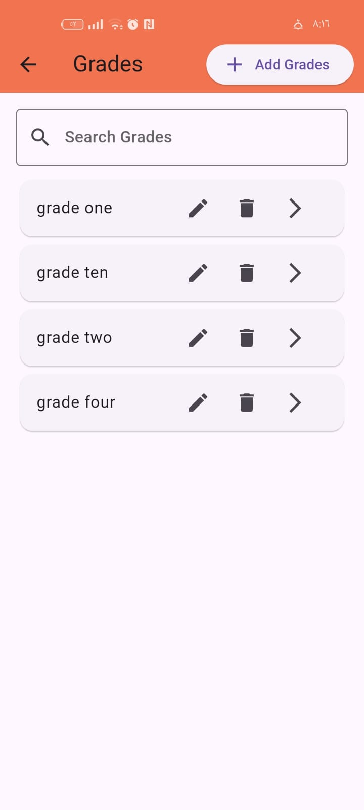
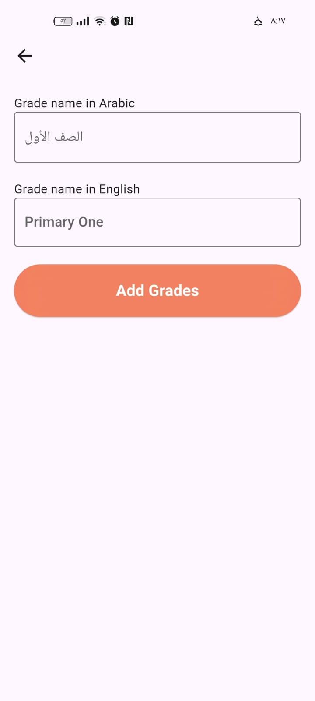
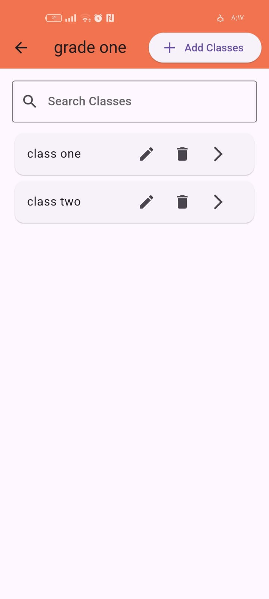
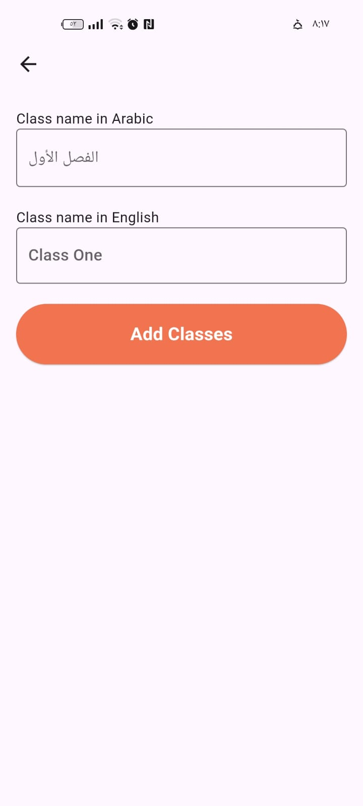

# Flutter Developer Assessment Task

## Overview

This task is designed to assess your skills in Flutter development, particularly in the areas of authentication and CRUD (Create, Read, Update, Delete) operations. You will be implementing a simple app with the following features:

1. **User Authentication**: Implement login functionality using username and password.
2. **CRUD Operations for School Grades**: Manage school grades with fields `name_ar`, `name_en`, and `school_id`.
3. **CRUD Operations for School Classes**: Manage school classes with fields `name_ar`, `name_en`, `grade_id`, and `school_id`.

You will be provided with the API endpoints necessary to complete the task.

## Task Requirements

### 1. Authentication

**Objective**: Implement a login screen that allows users to log in using their username and password.

- **Endpoint**: `/auth/login`
- **Method**: `POST`
- **Request Body**:
  ```json
  {
    "mobile": "user",
    "password": "pass"
  }
  ```
- **Response**:
  ```json
  {
    "token": "your_auth_token"
  }
  ```
- **Instructions**:
  - Create a login screen with fields for `username` and `password`.
  - On successful login, store the authentication token for use in subsequent API requests.
  - Navigate to the next screen after a successful login.
  
**UI Design**:
- Login Screen Mockup:
  
  

- Home Screen Mockup:
  
  

### 2. CRUD Operations for School Grades

**Objective**: Implement functionality to create, read, update, and delete school grades.

- **API Endpoints**:
  - **Create Grade**: `/school/grades`
    - **Method**: `POST`
    - **Request Body**:
      ```json
      {
        "name_ar": "Arabic Name",
        "name_en": "English Name",
        "school_id": 1
      }
      ```
  - **Get Grades**: `/school/grades`
    - **Method**: `GET`
  - **Update Grade**: `/school/grades/{id}`
    - **Method**: `PUT`
    - **Request Body**:
      ```json
      {
        "name_ar": "Updated Arabic Name",
        "name_en": "Updated English Name",
        "school_id": 1
      }
      ```
  - **Delete Grade**: `/school/grades/{id}`
    - **Method**: `DELETE`

- **Validation Note**:
  - When creating or updating a grade, the combination of `name_ar`, `name_en` must be unique. If this condition is not met, a `422 Unprocessable Entity` validation error will be returned.
  - The validation error message should be handled and displayed below the respective input fields that caused the error (e.g., below `name_ar` or `name_en` if the name is not unique).

- **Instructions**:
  - Create a screen to display a list of school grades.
  - Implement functionalities to add a new grade, update an existing grade, and delete a grade.
  - Handle validation errors by displaying error messages below the respective input fields.
  - Use the provided API endpoints to perform the above operations.
  - Ensure proper error handling for API requests.

**UI Design**:
- Grades List Screen Mockup:
  
  
  
- Add/Edit Grade Screen Mockup:
  
  

### 3. CRUD Operations for School Classes

**Objective**: Implement functionality to create, read, update, and delete school classes.

- **API Endpoints**:
  - **Create Class**: `/school/classes`
    - **Method**: `POST`
    - **Request Body**:
      ```json
      {
        "name_ar": "Arabic Name",
        "name_en": "English Name",
        "grade_id": 1,
        "school_id": 1
      }
      ```
  - **Get Classes**: `/school/classes`
    - **Method**: `GET`
  - **Update Class**: `/school/classes/{id}`
    - **Method**: `PUT`
    - **Request Body**:
      ```json
      {
        "name_ar": "Updated Arabic Name",
        "name_en": "Updated English Name",
        "grade_id": 1,
        "school_id": 1
      }
      ```
  - **Delete Class**: `/school/classes/{id}`
    - **Method**: `DELETE`

- **Validation Note**:
  - When creating or updating a class, the combination of `name_ar`, `name_en` must be unique. If this condition is not met, a `422 Unprocessable Entity` validation error will be returned.
  - The validation error message should be handled and displayed below the respective input fields that caused the error (e.g., below `name_ar` or `name_en` if the name is not unique).

- **Instructions**:
  - Create a screen to display a list of school classes.
  - Implement functionalities to add a new class, update an existing class, and delete a class.
  - Handle validation errors by displaying error messages below the respective input fields.
  - Use the provided API endpoints to perform the above operations.
  - Ensure proper error handling for API requests.

**UI Design**:
- Classes List Screen Mockup:
  
  
  
- Add/Edit Class Screen Mockup:
  
  

## Submission Guidelines

1. **Project Setup**:
   - Initialize a new Flutter project.
   - Structure the project following best practices (e.g., using MVVM, BLoC, or Provider for state management).

2. **Authentication**:
   - Implement secure storage for the authentication token.
   - Use the token in headers for authorized requests.

3. **UI/UX**:
   - Focus on creating a clean and user-friendly interface.
   - Implement proper input validation and error handling.
   - Ensure that the app is responsive and works well on different screen sizes.

4. **Code Quality**:
   - Write clean, maintainable, and well-documented code.
   - Use meaningful variable names and comments where necessary.
   - Ensure that the code is free from warnings and errors.

5. **Application Name**:
   - Name the application using your mobile number (e.g., `20101173520`).

6. **Submission**:
   - Upload the completed project to a Git repository (GitHub, GitLab, etc.).
   - Share the repository link along with any additional instructions or notes.  
   - Along with the repository link, provide the APK build of the app.

## Evaluation Criteria

- **Functionality**: How well the app meets the requirements.
- **Code Quality**: Cleanliness, readability, and maintainability of the code.
- **UI/UX**: User interface design and user experience.
- **Error Handling**: Proper management of errors and edge cases, especially validation errors.
- **Authentication**: Secure handling of the login process and API token.
---
This task is a basic simulation of a real-world project and will help assess your ability to work with Flutter, manage state, interact with APIs, and handle authentication and validation errors. Good luck!
